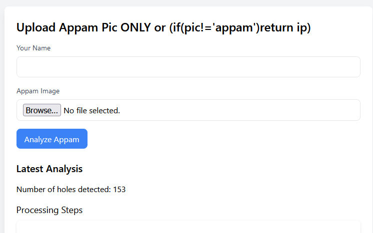
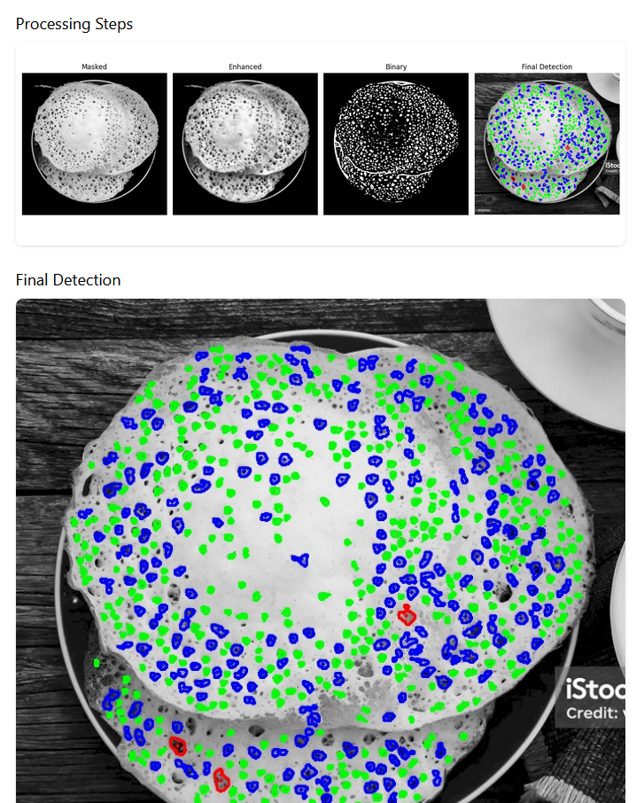
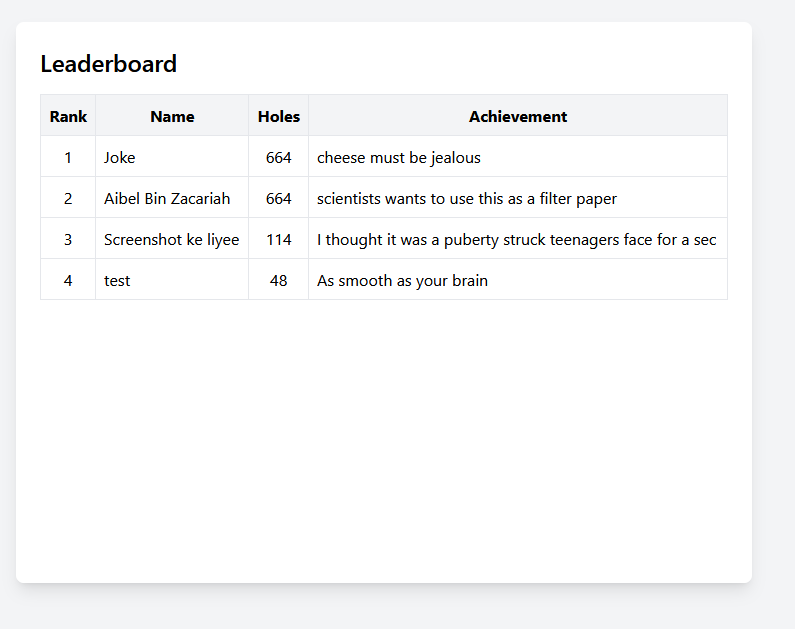
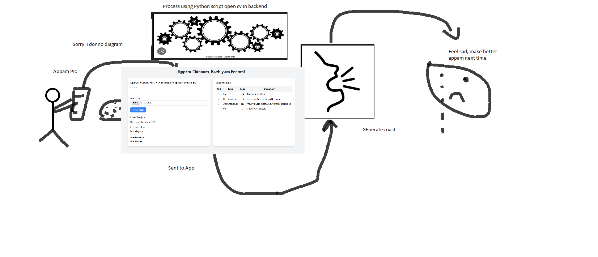

# Appam's Kuzhi Counter 🎯

## Basic Details
### Team Name: Suresh Gopi

### Team Members
- Team Lead: Aibel Bin Zacariah - St Josephs College of Engineering and Technology, Palai
- Member 2: Ashin Sabu Mathew - St Josephs College of Engineering and Technology, Palai

### Project Description
"Appam Thinnal Mathi, Kuzhi Ennenda"
I am so sick and tired of it, LIKE BRO! its 2024. DO BOTH!
So we used next level AI vision and leaderboard system(to boost ur ego) and built a hole analyzer for your APPAM! (It roasts you too btw.) 

### The Problem (that doesn't exist)
How annoying is it when you sit down for breakfast and its appam and you have to eat it with the weight of not knowing how many holes it has? well not anymoreeee. Here with this app you can do it all.

### The Solution (that nobody asked for)
I first created a python script which masks the appam from the plate and the surrounding, it then enhances the image using open cv which is then given gaussian blur, this then lets me filter out the colour difference (CUZ HOLES DIM LIGHT, GENUIS) and the viola, count it and BAM! thats how it is. 
Rest of the detaileddd nerd stuff given below.

## Technical Details
### Technologies/Components Used

- Python
- Flask, Tailwind CSS 
- flask, werkzeug, os, sqlite3, datetime, secrets, random, cv2, numpy matplotlib,CLAHE, Bilateral filtering
- allen wrench, 6" spanner (meme)

### Implementation
  (Nerd Stuff):
    First I created a python script which uses OpenCv to analyze the number of holes in the appam
    It first masks the appam to isolate it frm the background, it then enhances the image using CLAHE (Contrast Limited Adaptive Histogram Equalization) for enhancement (fancy thing I found yesterday while having dinner) 
    I then thought its not nice if all I can do is count the number of holes in your appam, I should also effectively roast you for it. and hence thats exactly what I did, Spent so long on Nextjs using prisma and couldnt figure out how to link the database's workflow as I was using python. But my will to roast the hell out of everyone was too high so I didnt give up and switched to flask framework (thank you Ashin for your suggession ) I also created a db for it to manage the entries (I hate you prisma) (love you flask) WELL And then the next big thing was hosting! We have appams kuzhi analyzer but still no github pages deployment for flask projects with dbs. Its okay, my boy Shawn Mendes hoooked me up with this new website pythonanywhere.com and I used it. and viola. Just like that, ITS LIVE. 

    Time has passed, its 3 am, I am thirsty, happy, Tired. BUT GUESS WHAT. WE have the world's first Software which can count the number of holes, roast you for it, and show it up in a leaderboard for you to always come back at if you ever feel sad. PS. I am not a saddist.  

# Installation
If you want to run it locally, create a venv and install matplotlib,cv2, flask, pull this frm git and then.. pray ig? cuz it works flawlessly 3/10 times cuz its python and cv2.

# Run
Run the app.py, python/python3 app.py

### Project Documentation

# Screenshots (Add at least 3)
!(Uploads tab)
*This is the upload tab where we can upload the pic of your appam*

!
(Analysis bar where matsplotlab is used to create the diagrams)
*Here you can see how the image is analyzed, Output is from matplotlib*

!(Leaderboard corner of the page)
*here we display the leaderboard for people to hate us*

# Diagrams
!(Workflow is very userfriendly.. and understandable from the documentation)
*Um... Sorry about that.*

### Project Demo
# Video
[https://drive.google.com/file/d/1vDTG0XgisqnnUkYY-zpSLHs44Lm5zkQ7/view?usp=sharing](Video LINK!)
*It may not be much, but its honest effort*

## Team Contributions
- Aibel Bin Zacariah: Development
- Ashin Sabu: Front end recommendations

Wanted to create a funny vlog typa youtube video too but Ive got lab exams tom. THANK YOU FOR THE HACKATHON. HAVE A GREAT DAY! 
---
Made with ❤️ at TinkerHub Useless Projects 

